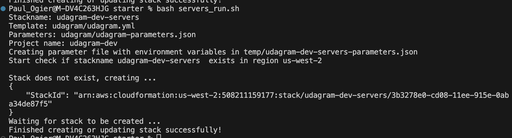

# CD12352 - Infrastructure as Code Project Solution
# Paul Ogier

## Spin up instructions - general
### Pre-requisites: Environment variables
* The AWS region is defined in your environment variables as `REGION`
  * This is useful to have a deployment across regions
* The stack name is defined as an environment variable `STACKNAME` 
* The environment (dev, stg, main) has been defined as an environment variabe `STACKENV`
* This calculate the stackname for network and servers, in lowercase, as well as the :
  * project name: `stackname-stackenv`
  * stackname for network: `stackname-stackenv-network` 
  * stackname for servers: `stackname-stackenv-servers`
  * example : `udacity-main`, `udacity-main-network`, `udacity-main-servers`

* This allow for separating cleanly projects (by their namespace) and environments (from development to production)

> Passing environment variables in parameters was really a pain. The AWS CloudFormation documentation is not clear at all on this point.

* The AWS CLI has been configured
* You can test the configurations using the `test_pre_requisites.sh` script that will perform multiple tests to validate your set-up 
* Verify the parameters in `network/network-parameters.json` and `udagram/udagram-parameters.json`

### Using the run script
* The `run.sh` will create or update a stack
* It requires the following parameters, named or positional:
  * `stackname`
  * `template`
  * `parameters`
  * `projectname`
* Example: `bash run.sh mystackname network/network.yml network/network-parameters.json udactity-name`
* It gives detailed explanations of what is happening

## As a network engineer
### Run
* Shortcut: make sure you have the environment variables sets and run `network_run.sh`

### Network description
The output of the `network.yml` template is:
* one VPC spanning two availability zones
* with one private and public subnet in each AZ
* One internet gateway 
* A NAT Gateway in each AZ's public subnet to allow the private subnet egress
* Associated route tables, elastic IPs

Network overview

Detailed network, with only one availability zone represented. This diagram is the output of the `network.yml` template

## As a servers engineer
### Run
* Shortcut: make sure you have the environment variables sets and run `servers_run.sh`

## Tear down instructions
* Use the `delete.sh` script with the parameter `stackname` to delete the stack you wish

## Project checklist
### Infrastructure Diagram
- [x] Network
- [ ] Final

### Network and Servers Configuration
|Requirement|Solved|Comment|
|---|---|---|
|You can deploy to any region.|true|Using the `REGION` environment variable|
|You'll need to create the networking infrastructure for your solution, including a new VPC and four subnets: two public and two private, following high availability best practices. |true|see network diagram|
|Use a parameters JSON file to pass CIDR blocks for your VPC and subnets.|true|`network/network-parameters.json`|
|You'll need to attach Internet and NAT gateways for internet access.|true|Yes, including Elastic IPs, see network diagrams|
|You'll need to use Launch Templates to create an Autoscaling Group for your application servers in order to deploy four servers, two located in each of your private subnets.|true|See the `WebAppLaunchTemplate` in `udagram/udagram.yml` |
|Your CPU and RAM requirements will be covered with t2.micro instances, so use this instance type. The Operating System to be used is Ubuntu 22.|true|idem|
|The application must be exposed to the internet using an Application Load Balancer.|true|See the `LoadBalancer` ressource|

### Static Content
- [x] You'll need to create an S3 bucket with CloudFormation to store all static content.
- [x] This bucket should have ~~public-read~~ `private` access.
- [x] Your servers IAM Role should provide read and write permissions to this bucket.

### Security Groups
- [x] Udagram communicates on the default HTTP Port: 80, so your servers will need this inbound port open since you will use it with the Load Balancer and the Load Balancer Health Check. As for outbound, the servers will need unrestricted internet access to be able to download and update their software.
- [x] The load balancer should allow all public traffic (0.0.0.0/0) on port 80 inbound, which is the default HTTP port.

### CloudFormation Templates
- [x] Considering that a network team will be in charge of the networking resources, you'll need to deliver two separate templates: one for networking resources and another one for your application specific resources (servers, load balancer, bucket).
  * In the `network` and `udagram` directories, respectively. Using separate directories for different teams is a good practice.
    * It allows to add `CODEOWNERS` for code governance
    * In CI-CD, It is easier to detect what was changed and what tests need to be run
- [x] Your application template should use outputs from your networking template to identify the hosting VPC and subnets.
- [x] One of the output exports of the CloudFormation application stack should be the public URL of the LoadBalancer.
- [x] Bonus points if you add http:// in front of the load balancer DNS Name in the output, for convenience.
- [x] You should be able to create and destroy the entire infrastructure using scripts (no UI interactions). You can use any language you like (bash or python, for example), but you must be using the CloudFormation CLI or libraries built on top of it (boto3, for example).
  * see the usage of `run.sh`, `delete.sh`, and `servers_run.sh` or `network_run.sh` in the chapter above

> All and all, it was a pain to work with both shell and CloudFormation documentation. It is much easier (condition, readability, debugging...) to define the code logic in Python. It was still fun to learn more shell scripting, and I can understand that shell is faster and more lightweight to execute.

### Output

##  BONUS (Optional features)
- [ ] Create a Cloudfront distribution to serve your static content.
- [ ] Set up a bastion host (jump box) to allow you to SSH into your private subnet servers. This bastion host would be on a Public Subnet with port 22 open only to your home IP address, and it would need to have the private key that you use to access the other servers.